<picture>
  <source media="(prefers-color-scheme: dark)" srcset="assets/neofetch-dark.svg">
  
</picture>

<a href="https://github.com/j0rdiun/cosmic-ext-app-switcher">
  <picture>
    <source media="(prefers-color-scheme: dark)" srcset="assets/switcher-dark.svg">
    
  </picture>
</a>

Hold <kbd>Super</kbd>, press <kbd>Tab</kbd>. The real one is <a href="https://github.com/j0rdiun/cosmic-ext-app-switcher">cosmic-ext-app-switcher</a>.

